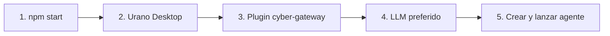
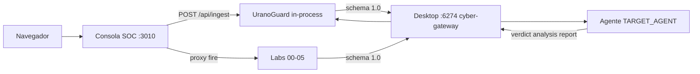
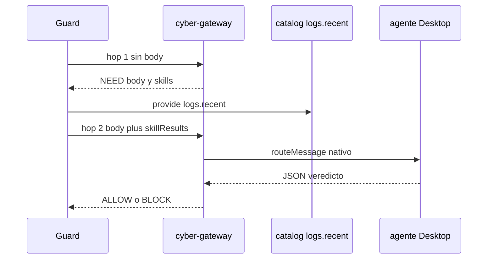

<h1 align="center">
  
</h1>

<p align="center">
  <strong>Labs in-process + consola SOC</strong><br />
  Apps de ejemplo que montan
  <a href="../urano-guard"><code>@uranotools/urano-guard</code></a>
  en el mismo proceso Node. El agente no vive aquí: es el webhook de
  <strong>Urano Desktop</strong> (cyber-gateway).
</p>

<p align="center">
  <a href="https://www.npmjs.com/package/@uranotools/urano-guard"></a>
  = 18" />
  
  
  
</p>

<p align="center">
  <a href="#arranque">Arranque</a>
  ·
  <a href="#cómo-encaja">Arquitectura</a>
  ·
  <a href="#consola-soc">Consola</a>
  ·
  <a href="#labs">Labs 00–06</a>
  ·
  <a href="AGENTS.md">Contribuir</a>
</p>

El hop remoto no es un SaaS oculto: es el webhook de **Urano Desktop** (plugin cyber-gateway).

```
http://127.0.0.1:6274/v1/webhook/mcp_cyber-gateway/default
```

**EN:** In-process Guard examples + a local SOC console. The remote agent is your Desktop webhook, not a hosted model in this repo.

> Esto no es un WAF de CDN, ni un SIEM, ni un producto con usuarios. Es un lab para ver el contrato schema 1.0 de punta a punta.

| | |
|---|---|
| Consola | **http://127.0.0.1:3010** tras `npm start` |
| Código UI | [`demos/06-soc-console/`](demos/06-soc-console/) |
| Cómo aportar | [`AGENTS.md`](AGENTS.md) |

---

## Qué hace (y qué no)

| Sí | No |
|---|---|
| Inspectores **in-process** (regex + heurística) | Terminar TLS / absorber DDoS |
| Agente en **tu** Desktop (modelo + API key del Vault) | Un LLM embebido en este repo |
| NEED → skills (`logs.recent`) → follow-up | Un cluster SIEM compartido |
| Honeypot en HTTP 200 cuando hay BLOCK | “200 = ALLOW” |
| Stack `npm start` (labs 00–06) | Login, roles, multi-tenant |

---

## Arranque

Hace falta Node **≥ 18**. El hop con LLM **no** está en este repo: vive en **Urano Desktop** (`:6274`).



### 1. Levantar el stack

```bash
cd ../urano-guard && npm install && npm run build
cd ../urano-guard-demos && npm install
npm start
```

Abre **http://127.0.0.1:3010** — Overview, Ataques, Live, SOC chat, Reportes, Labs, Settings.

| Comando | Qué levanta |
|---|---|
| `npm start` | Stack 00–06. Ctrl+C lo apaga. |
| `npm run start:06` | Solo la consola (`:3010`) |
| `npm run dev:06` | Vite `:5173` + API `:3010` |
| `set AGENT_URL=stub` | Sin Desktop: stub de reglas, no LLM |

Las labs ya responden. El hop remoto (análisis, `NEED`, reportes) espera el agente de abajo.

### 2. Descargar Urano Desktop

1. Entra a **[uranoai.com/workspace](https://uranoai.com/workspace)** e instala **Urano Desktop**.
2. Ábrelo. El webhook local queda en `:6274`.

### 3. Instalar el plugin `cyber-gateway`

En Desktop: **MCP Manager**.

- Empaquetado / marketplace: instala **cyber-gateway**.
- Si clonaste los plugins: **Desarrollador → Vincular carpeta local** y elige `UranoDesktop-plugins/cyber-gateway` (el directorio con `config.ts`).

El canal canónico de las demos (sin fila en Canales) es:

```
http://127.0.0.1:6274/v1/webhook/mcp_cyber-gateway/default
```

### 4. Conectar tu LLM

En Desktop, **Ajustes / proveedores**: elige el proveedor (OpenAI, Anthropic, Azure, Ollama, …) y guarda la API key en el **Vault**. Este repo **no** lleva claves.

### 5. Crear el agente y lanzarlo

1. **Nuevo agente**.
2. Activa el módulo **cyber-gateway** (así entran las skills MCP y el `SKILL.md` del plugin: veredicto JSON schema 1.0).
3. Revisa o pega las instrucciones SOC (el plugin ya pide `ALLOW` / `BLOCK` / `NEED` + `analysis` / `report`).
4. En el agente, configura el **proveedor y el modelo** que acabas de conectar.
5. **Lánzalo** (tiene que quedar en marcha; si está apagado el webhook no tiene a quién hablar).
6. En el Vault de **cyber-gateway**, `TARGET_AGENT`: ese agente (o Enrutador). Vacío = Hybrid Router.

Si el Vault tiene `INCOMING_WEBHOOK_SECRET`, copia [`.env.example`](.env.example) (`AGENT_TOKEN` / `AGENT_HMAC`) en las demos.

**EN:** After `npm start`, install [Urano Desktop](https://uranoai.com/workspace), add the `cyber-gateway` plugin, connect your LLM in the Vault, create an agent with that plugin + provider/model, launch it, and set `TARGET_AGENT`.

---

## Cómo encaja



Cada lab tiene **su propio** Guard y `ThreatRegistry`. El hub puede **copiar** un disparo a Overview; no comparte bloqueos de IP entre procesos.



Hop 1 dura milisegundos (sin LLM). Hop 2 suele irse a **~8–20 s**. Un jailbreak obvio lo puede cortar el Engine **antes** del modelo.

---

## Consola SOC

Carpeta: [`demos/06-soc-console/`](demos/06-soc-console/) — Express + Vue 3, **sin login**.

| Página | Para qué |
|---|---|
| Overview | KPIs y gráficas del ring de **esta sesión** |
| Ataques | Fixtures (benign, jailbreak, SQLi, padding, XSS, prompt) |
| Live | SSE, logs, honeypot, IPs de **este** proceso |
| SOC chat | Planificar análisis; **no** pasa por `guard.inspect()` |
| Reportes | Copia local en `data/reports.json` |
| Labs | Health cada 4 s + disparos proxy |
| Settings | `AGENT_URL` (Desktop / Cloud `/t/{id}` / `stub`) |

El modelo **no** se configura aquí: es el del agente en Desktop.

---

## Labs

Registro canónico (el hub **no** hardcodea puertos en Vue): [`packages/shared/labs.ts`](packages/shared/labs.ts).

| Id | Solo | En el stack | Ingest |
|---|---|---|---|
| 00 min contract | `:3000` | **`:3006`** | `POST /chat` |
| 01 control plane | `:3000` | `:3000` | `POST /api/ingest` |
| 02 NEED + body | `:3002` | `:3002` | `POST /api/ingest` + log de hops `:8791` |
| 03 payments | `:3003` | `:3003` | `POST /webhooks/payments` (`monitor_only`) |
| 04 nginx app | `:3004` | `:3004` | `POST /api/ingest` |
| 05 resilience | `:3005` | `:3005` | `POST /api/ingest` |
| 06 SOC console | `:3010` | `:3010` | hub + UI |

00 en el stack usa **3006** para no pelear el puerto con 01.

---

## Añadir una demo

Es corto: copias `demos/00-min-contract`, expones `GET /health`, una fila en `labs.ts` y un script en el `package.json` raíz. **No hace falta tocar Vue.**

Plantilla y checklist: **[AGENTS.md](AGENTS.md)** (humanos y agentes de código).

---

## Límites honestos

- Inspectores en el hot path de **tu** Node. No hay edge network.
- Timeout típico del hop LLM: ~20 s (Guard en demos ~35 s; cyber-gateway 30 s).
- Overview se borra al matar el proceso.
- `server.blockIp` solo vale en el proceso que lo ejecuta.
- Skills MCP de Desktop no reescriben el `ThreatRegistry` de este repo.

---

## Docs

| Archivo | Cuándo |
|---|---|
| [AGENTS.md](AGENTS.md) | Añadir lab, payload, página Vue |
| [demos/06-soc-console/README.md](demos/06-soc-console/README.md) | Solo el hub |
| [../urano-guard/CUSTOM_AGENT.md](../urano-guard/CUSTOM_AGENT.md) | Contrato remote agent 1.0 |
| [../urano-guard/AGENTS.md](../urano-guard/AGENTS.md) | Inspectores del SDK |
